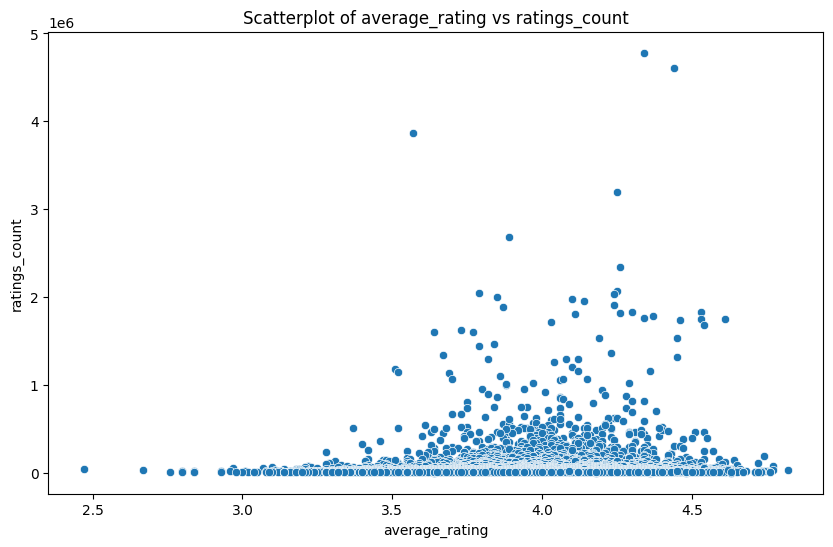
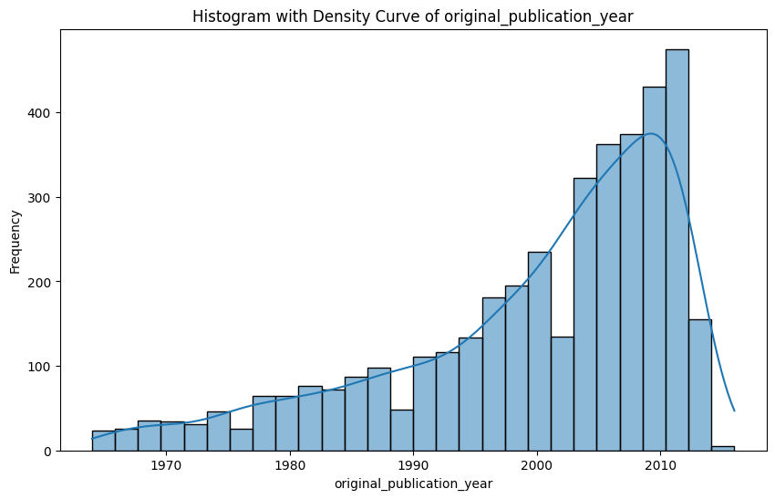
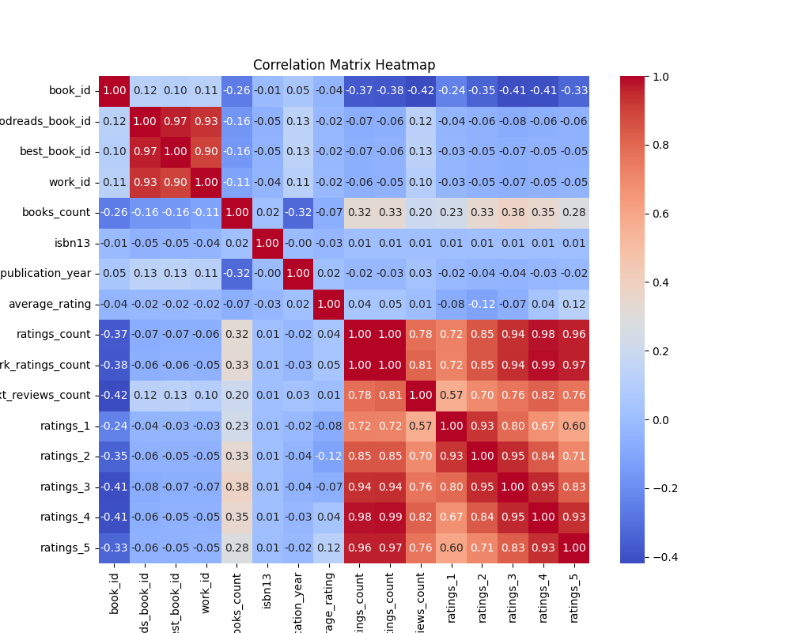

# README.md

## Title
Analysis of Popular Books Dataset: Ratings and Trends

## Introduction
This report analyzes a dataset containing information on popular books from various genres. This dataset is intended to provide insights into book ratings, publication years, authors, and reader interactions on platforms like Goodreads. By examining this data, we can unearth patterns and correlations that help authors, publishers, and readers understand the landscape of popular literature.

## Preliminary Analysis
### Missing Values
The dataset has several attributes with missing values, notably:
- `isbn`: 700 missing entries
- `isbn13`: 585 missing entries
- `original_publication_year`: 21 missing entries
- `original_title`: 585 missing entries
- `language_code`: 1084 missing entries

The presence of missing values, especially in key areas such as `isbn`, `original_publication_year`, and `language_code`, may hinder the analysis and necessitates a decision on how to handle it, possibly through imputation or exclusion.

### Outlier Detection
Outlier counts reveal several possible inconsistencies in ratings and publication details, with notable figures:
- `goodreads_book_id`: 78 outliers
- `average_rating`: 72 outliers
- `work_text_reviews_count`: 151 outliers

These outliers may represent books with either exceptional popularity or significant reader engagement, making them worthy of further investigation but can distort averages.

### Correlation Analysis
The correlation matrix analysis indicates several relationships:
- `ratings_count` and `work_ratings_count` have a correlation coefficient of 0.995068, indicating they are strongly correlated.
- Negative correlations exist between `average_rating` and `work_text_reviews_count` (-0.421292), suggesting that higher-rated books may not necessarily have as many text reviews.
- `books_count` shows a notable correlation (0.324235) with `ratings_count`, indicating that popular books often have a higher count of books associated, possibly due to multi-part series.

## Visualization Analysis
- **Graph Type**: Scatterplot
    - **Insights**: This visualization allows us to see the relationship between `average_rating` vs `ratings_count`. It shows a trend where books with higher ratings also have higher ratings counts, though the scatter suggests a natural plateau, indicating that extreme positive ratings may not lead to significantly more reviews.
  
- **Graph Type**: Histogram with Density Curve
    - **Insights**: This explored the distribution of average ratings. The density curve suggests a normal distribution peaking around 4.0-4.5, indicating that most readers tend to rate books positively. 

### Correlation Matrix Heatmap Discussion
The heatmap provides a visual perspective of the correlation values:
- Strong positive correlations are evident in the ratings-related fields, emphasizing the importance of looking into book engagement through reviews and ratings.
- Negative correlations with `average_rating` and reader engagement metrics suggest further exploration into why higher-rated books might have fewer text reviews.

## Key Insights
1. **Popular Books**: Books with higher ratings tend to receive a higher number of total ratings, indicating reader trust in recommendations.
2. **Outliers and Trends**: Certain books garner exceptional attention, suggesting that strategies used for their marketing could be advantageous if applied to less popular titles.
3. **Publication Trends**: Analyzing the `original_publication_year` could reveal trends in literature movements over decades.

## The Implications of Findings
- **Marketing Strategy**: Publishers can focus marketing efforts on high-rating, high-engagement titles, using them as benchmarks for future releases.
- **Engagement Tactics**: There’s potential to develop campaigns aimed at encouraging reviews for high-rated books to further enhance engagement, possibly through reader contests or special content.
- **Content Development**: Identifying successful genres or authors can inform new book acquisition or development strategies for publishers.

## Conclusion
This analysis underscores the importance of understanding reader behavior and book performance metrics to optimize book visibility and reader engagement. Future recommendations include:
- Addressing missing values to strengthen data reliability.
- Conducting further focused research on outliers to explore unique reader engagement.
- Investigating publication trends to inform future literary initiatives.

Continued examination can provide deeper insights into the evolving dynamics of book readership and marketing.

## Preliminary Test Results

Missing Values:
book_id                         0
goodreads_book_id               0
best_book_id                    0
work_id                         0
books_count                     0
isbn                          700
isbn13                        585
authors                         0
original_publication_year      21
original_title                585
title                           0
language_code                1084
average_rating                  0
ratings_count                   0
work_ratings_count              0
work_text_reviews_count         0
ratings_1                       0
ratings_2                       0
ratings_3                       0
ratings_4                       0
ratings_5                       0
image_url                       0
small_image_url                 0

Correlation Matrix:
                            book_id  goodreads_book_id  best_book_id   work_id  books_count    isbn13  original_publication_year  average_rating  ratings_count  work_ratings_count  work_text_reviews_count  ratings_1  ratings_2  ratings_3  ratings_4  ratings_5
book_id                    1.000000           0.115154      0.104516  0.113861    -0.263841 -0.011291                   0.049875       -0.040880      -0.373178           -0.382656                -0.419292  -0.239401  -0.345764  -0.413279  -0.407079  -0.332486
goodreads_book_id          0.115154           1.000000      0.966620  0.929356    -0.164578 -0.048246                   0.133790       -0.024848      -0.073023           -0.063760                 0.118845  -0.038375  -0.056571  -0.075634  -0.063310  -0.056145
best_book_id               0.104516           0.966620      1.000000  0.899258    -0.159240 -0.047253                   0.131442       -0.021187      -0.069182           -0.055835                 0.125893  -0.033894  -0.049284  -0.067014  -0.054462  -0.049524
work_id                    0.113861           0.929356      0.899258  1.000000    -0.109436 -0.039320                   0.107972       -0.017555      -0.062720           -0.054712                 0.096985  -0.034590  -0.051367  -0.066746  -0.054775  -0.046745
books_count               -0.263841          -0.164578     -0.159240 -0.109436     1.000000  0.017865                  -0.321753       -0.069888       0.324235            0.333664                 0.198698   0.225763   0.334923   0.383699   0.349564   0.279559
isbn13                    -0.011291          -0.048246     -0.047253 -0.039320     0.017865  1.000000                  -0.004612       -0.025667       0.008904            0.009166                 0.009553   0.006054   0.010345   0.012142   0.010161   0.006622
original_publication_year  0.049875           0.133790      0.131442  0.107972    -0.321753 -0.004612                   1.000000        0.015608      -0.024415           -0.025448                 0.027784  -0.019635  -0.038472  -0.042459  -0.025785  -0.015388
average_rating            -0.040880          -0.024848     -0.021187 -0.017555    -0.069888 -0.025667                   0.015608        1.000000       0.044990            0.045042                 0.007481  -0.077997  -0.115875  -0.065237   0.036108   0.115412
ratings_count             -0.373178          -0.073023     -0.069182 -0.062720     0.324235  0.008904                  -0.024415        0.044990       1.000000            0.995068                 0.779635   0.723144   0.845949   0.935193   0.978869   0.964046
work_ratings_count        -0.382656          -0.063760     -0.055835 -0.054712     0.333664  0.009166                  -0.025448        0.045042       0.995068            1.000000                 0.807009   0.718718   0.848581   0.941182   0.987764   0.966587
work_text_reviews_count   -0.419292           0.118845      0.125893  0.096985     0.198698  0.009553                   0.027784        0.007481       0.779635            0.807009                 1.000000   0.572007   0.696880   0.762214   0.817826   0.764940
ratings_1                 -0.239401          -0.038375     -0.033894 -0.034590     0.225763  0.006054                  -0.019635       -0.077997       0.723144            0.718718                 0.572007   1.000000   0.926140   0.795364   0.672986   0.597231
ratings_2                 -0.345764          -0.056571     -0.049284 -0.051367     0.334923  0.010345                  -0.038472       -0.115875       0.845949            0.848581                 0.696880   0.926140   1.000000   0.949596   0.838298   0.705747
ratings_3                 -0.413279          -0.075634     -0.067014 -0.066746     0.383699  0.012142                  -0.042459       -0.065237       0.935193            0.941182                 0.762214   0.795364   0.949596   1.000000   0.952998   0.825550
ratings_4                 -0.407079          -0.063310     -0.054462 -0.054775     0.349564  0.010161                  -0.025785        0.036108       0.978869            0.987764                 0.817826   0.672986   0.838298   0.952998   1.000000   0.933785
ratings_5                 -0.332486          -0.056145     -0.049524 -0.046745     0.279559  0.006622                  -0.015388        0.115412       0.964046            0.966587                 0.764940   0.597231   0.705747   0.825550   0.933785   1.000000

Outlier Counts:
book_id: 0
goodreads_book_id: 78
best_book_id: 87
work_id: 254
books_count: 178
isbn13: 33
original_publication_year: 53
average_rating: 72
ratings_count: 108
work_ratings_count: 119
work_text_reviews_count: 151
ratings_1: 73
ratings_2: 121
ratings_3: 135
ratings_4: 134
ratings_5: 108

## Visualizations

### Scatterplot

### Histogram With Density Curve

### Correlation Matrix Heatmap

