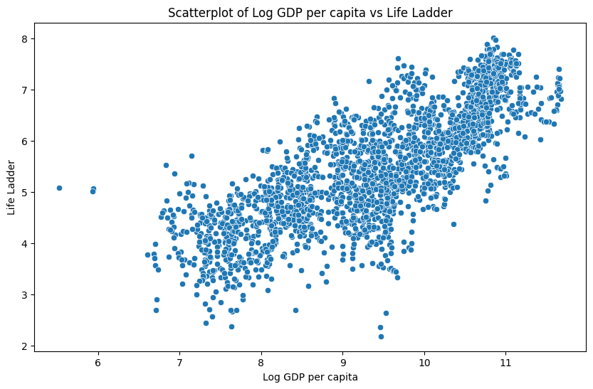
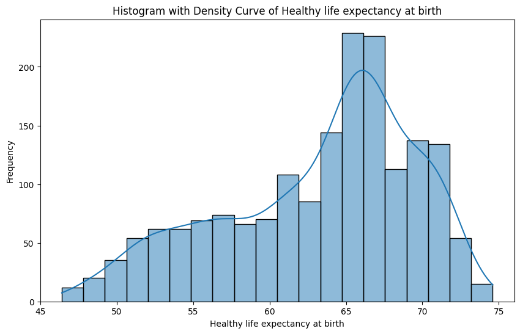
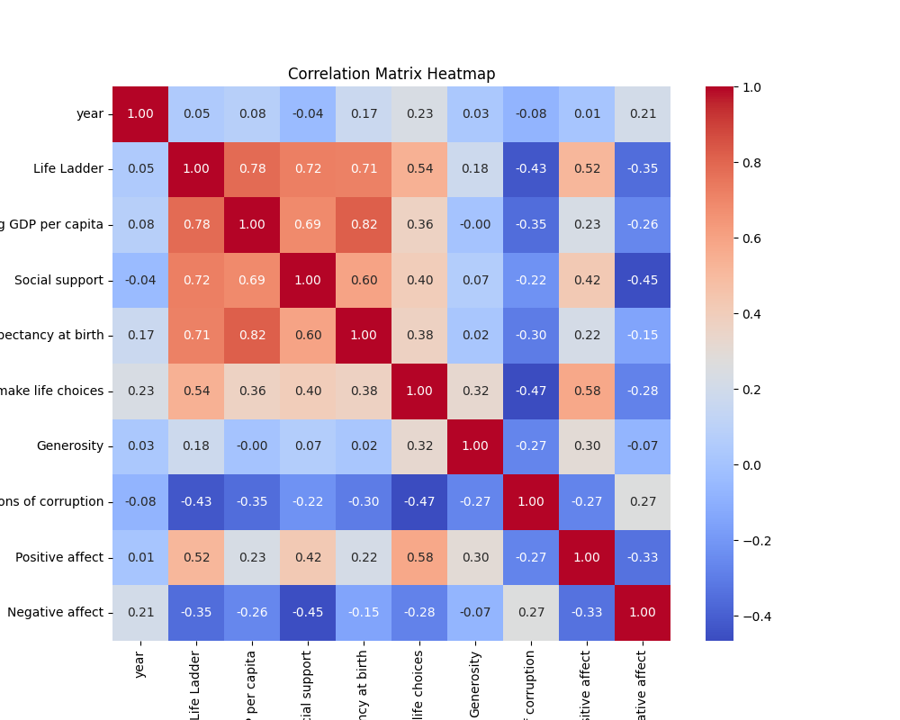

# README.md Report

## Title: Analyzing Life Quality Indicators by Country (2007-2023)

## Introduction
This report explores various quality of life indicators across multiple countries from the years 2007 to 2023. The dataset provides key metrics such as Life Ladder, Log GDP per capita, Social Support, Healthy Life Expectancy at Birth, Freedom to Make Life Choices, Generosity, and Perceptions of Corruption. The primary purpose of this analysis is to identify trends, correlations, and actionable insights related to these indicators, focusing specifically on significant changes over time and interrelationships among the metrics.

## Preliminary Analysis
### Missing Values
The dataset has several missing values spread across different columns:
- **Log GDP per capita**: 28 missing entries
- **Social support**: 13 missing entries
- **Healthy life expectancy at birth**: 63 missing entries
- **Freedom to make life choices**: 36 missing entries
- **Generosity**: 81 missing entries
- **Perceptions of corruption**: 125 missing entries
- **Positive affect**: 24 missing entries
- **Negative affect**: 16 missing entries

These missing values may skew our analysis and should be handled appropriately, possibly through imputation methods or exclusion.

### Outlier Detection
Outliers were detected across several indicators. Notably:
- **Life Ladder** had 2 outliers,
- **Log GDP per capita** had 3 outliers,
- **Social support** had 23 outliers, among others.

Outliers can indicate significant variances in the dataset and could influence correlation results; they require further investigation.

### Correlation Analysis
The correlation matrix indicates the following:
- **Life Ladder** correlates positively with **Log GDP per capita** (0.78) and **Social support** (0.72), suggesting wealth and social support improve overall life satisfaction.
- **Generosity** shows a weak correlation with other metrics, indicating limited influence on the Life Ladder.
- **Negative affect** has a negative correlation with Life Ladder (-0.35), suggesting that as negative feelings increase, life satisfaction decreases.

## Visualization Analysis
### Scatterplot
- The scatterplot provides a visual representation of the relationship between two variables, such as Life Ladder against Log GDP per capita. Peaks and trends in the data can be observed, showcasing the linear relationship between economic performance and life satisfaction.

### Histogram with Density Curve
- This visualization allows us to observe the distribution of a variable (e.g., Life Ladder) along with its density distribution, highlighting data concentration and potential skewness. 

### Correlation Matrix Heatmap
- The heatmap visually represents the correlation coefficients found in the exploratory analysis.
- Strong positive correlations between Life Ladder and Log GDP per capita, Social support, and Healthy life expectancy at birth indicate that these factors significantly contribute to perceived life quality.
- Negative correlations with Perceptions of corruption emphasize that lower corruption perception correlates with higher life satisfaction.

## Key Insights
- Countries with higher Log GDP per capita tend to have a better Life Ladder score, emphasizing the importance of economic health for life satisfaction.
- Social support and Healthy life expectancy are also significantly linked to Life Ladder.
- High levels of perceived corruption detrimentally impact life satisfaction, indicating a need for governance reforms in affected regions.
- Addressing missing values and outliers will refine future analyses and insights.

## Conclusion
The analysis reveals significant insights into the factors influencing life satisfaction across various countries. The strong correlations suggest that policies focusing on economic growth, social support networks, and reductions in corruption can greatly enhance quality of life. Future recommendations include improving data collection to minimize missing values, investigating outlier cases, and conducting deeper analyses on how these indicators interact over time to foster more robust societies. Further studies could also explore more recent years to assess trends post-2023.

## Preliminary Test Results

Missing Values:
Country name                          0
year                                  0
Life Ladder                           0
Log GDP per capita                   28
Social support                       13
Healthy life expectancy at birth     63
Freedom to make life choices         36
Generosity                           81
Perceptions of corruption           125
Positive affect                      24
Negative affect                      16

Correlation Matrix:
                                      year  Life Ladder  Log GDP per capita  Social support  Healthy life expectancy at birth  Freedom to make life choices  Generosity  Perceptions of corruption  Positive affect  Negative affect
year                              1.000000     0.046846            0.080104       -0.043074                          0.168026                      0.232974    0.030864                  -0.082136         0.013052         0.207642
Life Ladder                       0.046846     1.000000            0.783556        0.722738                          0.714927                      0.538210    0.177398                  -0.430485         0.515283        -0.352412
Log GDP per capita                0.080104     0.783556            1.000000        0.685329                          0.819326                      0.364816   -0.000766                  -0.353893         0.230868        -0.260689
Social support                   -0.043074     0.722738            0.685329        1.000000                          0.597787                      0.404131    0.065240                  -0.221410         0.424524        -0.454878
Healthy life expectancy at birth  0.168026     0.714927            0.819326        0.597787                          1.000000                      0.375745    0.015168                  -0.303130         0.217982        -0.150330
Freedom to make life choices      0.232974     0.538210            0.364816        0.404131                          0.375745                      1.000000    0.321396                  -0.466023         0.578398        -0.278959
Generosity                        0.030864     0.177398           -0.000766        0.065240                          0.015168                      0.321396    1.000000                  -0.270004         0.300608        -0.071975
Perceptions of corruption        -0.082136    -0.430485           -0.353893       -0.221410                         -0.303130                     -0.466023   -0.270004                   1.000000        -0.274208         0.265555
Positive affect                   0.013052     0.515283            0.230868        0.424524                          0.217982                      0.578398    0.300608                  -0.274208         1.000000        -0.334451
Negative affect                   0.207642    -0.352412           -0.260689       -0.454878                         -0.150330                     -0.278959   -0.071975                   0.265555        -0.334451         1.000000

Outlier Counts:
year: 0
Life Ladder: 2
Log GDP per capita: 3
Social support: 23
Healthy life expectancy at birth: 14
Freedom to make life choices: 10
Generosity: 21
Perceptions of corruption: 34
Positive affect: 10
Negative affect: 18

## Visualizations

### Scatterplot

### Histogram With Density Curve

### Correlation Matrix Heatmap

