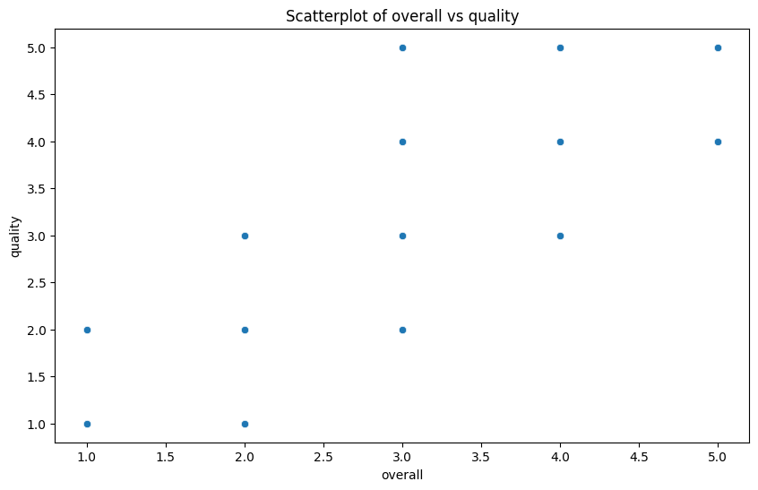

# README.md Report: Analysis of Movie Dataset

## Title
Analysis of Movie Ratings Dataset: A Comprehensive Review of Language Diversity and Viewer Preferences

## Introduction
This dataset captures information regarding various movies and series, including their release date, language, type, cast, and viewer ratings (overall, quality, and repeatability). The primary purpose of this analysis is to offer insights into the preferences of viewers across different languages and movie types, identify trends, and evaluate the correlation between different rating parameters to inform potential future content production strategies.

## Preliminary Analysis
### Missing Values
The dataset shows a total of **99 missing values** in the `date` field. Other columns such as `language`, `type`, `title`, `overall`, `quality`, and `repeatability` do not have any missing values, though the `by` column has **262 missing entries** (which likely indicates missing information regarding the cast). Addressing these missing values, particularly in the `date` and `by` columns, is critical for the robustness of the analysis.

### Outlier Detection
The analysis shows **no outlier counts** reported for the `overall`, `quality`, and `repeatability` ratings, indicating a consistent rating pattern across the dataset without extreme values skewing the results.

### Correlation Analysis
The correlation matrix reflects significant relationships between the rating variables:

- The correlation between `overall` and `quality` is **0.826**, indicating a strong positive relationship; higher quality ratings are associated with higher overall ratings.
- The correlation between `overall` and `repeatability` stands at **0.513**, suggesting a moderate positive correlation; as viewers rate their experience higher, they are likely to indicate greater repeatability.
- The `quality` rating's correlation with `repeatability` is weaker at **0.312**, suggesting that quality alone may not strongly influence the likelihood of viewers rewatching a film.

## Visualization Analysis
### Scatterplot
The scatterplot (refer to `scatterplot.png`) illustrates the relationship between `overall` ratings and `quality` ratings. The positive slope indicates that as quality ratings increase, overall ratings tend to increase as well. This finding reinforces the correlation analysis that higher perceived quality resonates with a higher overall enjoyment by viewers.

### Histogram with Density Curve
The histogram with a density curve (see `histogram_with_density_curve.png`) represents the distribution of overall ratings. The shape of the histogram suggests a normal distribution with a slight skew towards higher ratings, implying that most viewers tend to rate films positively.

### Correlation Matrix Heatmap
The heatmap of the correlation matrix provides an excellent visual summary of the relationships between the rating metrics. The darker shades indicating stronger correlations effectively convey statistical relevance at a glance, emphasizing the relationships detailed previously.

## Key Insights
1. **Quality Matters**: Movies that are rated higher in terms of quality correlate strongly with overall viewer satisfaction. This indicates that producers should prioritize quality in scriptwriting, direction, and production values.
2. **Moderate Repeatability**: While most viewers seem satisfied, not all high-quality productions lead to increased repeatability, suggesting that factors beyond quality—such as genre or themes—may influence rewatching decisions.
3. **Missing Data Issues**: The presence of missing values in the `date` and `by` fields should be addressed to enhance the integrity of subsequent analyses.

## Implications of Findings
Given the insights on quality and viewer satisfaction, content creators and marketing teams could focus more on quality assurance processes before production and ensure that attractive and meaningful content is prioritized, particularly for films with higher potential for repeat viewership. They should also consider conducting follow-up studies or surveys to gather additional data on viewer preferences and influences that drive future viewing choices.

## Conclusion
The analysis reveals that quality ratings have a significant impact on overall viewer ratings, with moderate implications for repeat viewing behavior. While the dataset is relatively clean with minimal outlier concerns, addressing missing data is critical. Moving forward, continuous monitoring and analysis of viewer ratings and preferences will ensure that content remains relevant and engaging. Further segmented analyses (e.g., genre-specific trends, creator comparisons) could yield additional actionable insights for tailored content creation.

## Preliminary Test Results

Missing Values:
date              99
language           0
type               0
title              0
by               262
overall            0
quality            0
repeatability      0

Correlation Matrix:
                overall   quality  repeatability
overall        1.000000  0.825935       0.512600
quality        0.825935  1.000000       0.312127
repeatability  0.512600  0.312127       1.000000

Outlier Counts:
overall: 0
quality: 0
repeatability: 0

## Visualizations

### Scatterplot

### Histogram With Density Curve

### Correlation Matrix Heatmap

